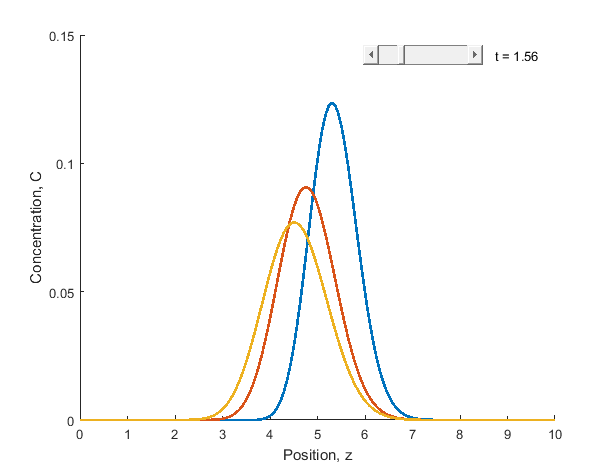
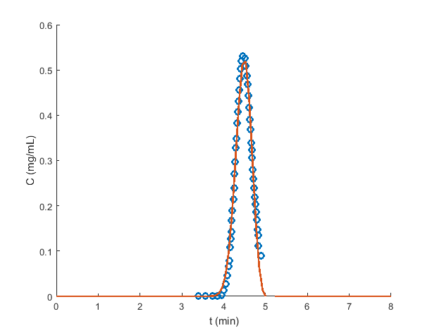
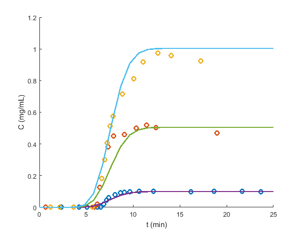
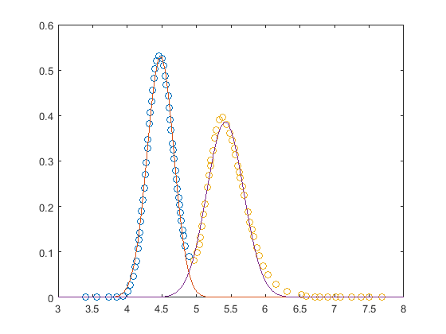

# chromatography
A suite of chromatography programms including breakthrough curve modelling, isotherm determination, parameters fitting, chromatographic peak fitting and peak deconvolution, and more...


## Breif description of each function
- `fit_klinkenberg.m` - Fit Klinkenberg model to experimental data
- `models/klinkenberg.m` - Klinkenberg model


## Chromatographic models

### Klinkenberg model (`models/klinkenberg.m`)

Klinkenberg provides an useful approximation to the analytical solution of the Convection-Dispersion model proposed by Anzelius for the case of a single solute, an initially clean bed, frontal loading and negligible axial dispersion. According to the Klinkenberg approximation the solute concentration respect to axial distance and time is given by:

$$\frac{C}{C_\mathrm{F}} \approx \frac{1}{2} [ 1 + \text{erf}( \sqrt{\tau} - \sqrt{\xi} + \frac{1}{8 \sqrt{\tau}} + \frac{1}{8 \sqrt{\xi}} ) ]$$

$$\tau = K (t - \frac{z}{u_i})$$

$$\xi = \frac{K H z}{u_i} (\frac{1 - \varepsilon_b}{\varepsilon_b})$$


## Fit functions

### `fit_klinkenberg´

Fit the Klinkenberg model (H and K parameters) to the data provided. 

Arguments:

- `exp_tc` : array of n-by-2 matrices
  
  Data to fit the model. The array has m elements, each corresponding to a dataset. Each dataset has a n-by-2 matrix with t and c values (columns) and n datapoints (lines).

- `exp_Cfeed` : vector with m elements (one per dataset)

  Feed concentration.

- `H_est` : float

  Initial estimate for the Klinkenberg linear equilibrium constant.

- `K_est` : float

  Initial estimate for the Klinkenberg mass transfer coefficient.

- `L` : float

  Column length.

- `Di` : float

  Column diameter.

- `epsb` : float

  Bed porosity.

- `Q` : float

  Flow-rate.

- `tfinal` : float

  Final time for calculation. Should be higher than the highest time in the experimental datasets.

- `opt` : struct

  Options: `opt.fig` (true | false) specify if the model function should make a plot.

Notes:

Any number of diferent experiments ([t c] datasets) can be used by expanding the ´exp_Cfeed´ and ´exp_tc´ arrays to include additional data. Parameters are fitted to all data simultaneously.

---

## Breif description of each function
* `gaussPeakFit` - Fits a gaussian curve to the data provided. Works for any number of peaks.
* `gaussPeakFit_1p` - Same as gaussPeakFit but is a simpler version that only works for one peak.
* `isotherm` - Library of isotherm function. Required in several programs. 
* `fitModel_isotherm_KLDF` - Fits a chromatographic model to the data provided. Two parameters are fitted: H and KLDF.
* `LDF_pdepe` - Transport-Dispersive Model (TDM) considering mass transfer resistence in the solid to be dominant and using the Linear Driving Force Model (LDF) approach. Uses the Matlab pdepe function to solve the system of PDEs.
* `Models/klinkenberg.m` - Same as `LDF_pdepe` but only works for one component
* `Models/LDF_pdepe_1c.m` - Same as `LDF_pdepe` but only works for one component
* `Models/LDF_pdepe_2c.m` - Same as `LDF_pdepe` but only works for two components
* `Models/LDF_df_1c.m` - Transport-Dispersive Model (TDM) considering mass transfer resistence in the solid to be dominant and using the Linear Driving Force Model (LDF) approach. Uses the finite diferences methods to solve the system of PDEs.
* `Models/EDMlinear_pdepe_1c.m` - Equilibrium-Dispersive Model (EDM) with linear isotherm for single component.
* `Models/TDMlinear_pdepe_1c.m` - Transport-Dispersive Model (TDM) with linear isotherm for single component.
* `Models/TMlinear_pdepe_1c.m` - Transport Model (TM) with linear isotherm for single component.

## Detailed description of the main functions

### **LDF_pdepe**
LDF_pdepe models a chromatographic experiement according to the Transport-Dispersive Model (TDM) considering mass transfer resistence in the solid to be dominant and using the Linear Driving Force Model (LDF) approach (Glauckauf and Coates, 1947). Uses pdepe functin to solve the system of partial differential equations. 

##### INPUTS: 
`isoType` : the isotherm model accordding to the isotherm function. E.g. 'linear'.

`feedProf` : the feed profile, can be 'pulse' (e.g.: chromatografic peak) or 'step' (e.g.: breakthrough experiment).

`parameter` : Matrix containing the isotherm parameters for all components according to the isotherm function.

`L` : column length (cm)

`Di` : column diameter (cm)

`epsb` : bulk porosity

`Q` : flow rate (mL/min)

`Cfeed` : feed concentration

`KLDF` : Linear driving force mass transfer coefficient (min-1)

`Dax` : axial dispersion coefficient (cm2/min)

`tpulse` : feed pulse duration. For a step injection set tpulse = tfinal (min).

`tfinal` : final time for calculation (min)

`opt` : structure containig calculation options: `opt.npz`: number of discretization points in `z`; 

`opt.npt`: number of discretization points in `t`.


##### OUTPUTS:

Figure of the concentration profiles inside the column and concentration history at column outlet (chromatogram).

##### Example:

Concentration profiles inside the column over time for a pulse injection of 3 components.



---

### **fitModel_isotherm_KLDF**
fitModel_isotherm_KLDF fits the chromatographic model to the data provided. By default the LDF model with axial dispersion is used (`LDF_pdepe`) and two parameters are fitted: `H`, the linear equilibrium constant and `KLDF`, the linear driving force mass transfer coefficient.

Any number of diferent experiments can be fitted simultaneously usedy expanding `exp_Cfeed` and `exp_tc` to include additional data. Parameters are fitted to all data simultaneously.

##### INPUTS: 
`exp_tc` : an array containg any number of experimental data sets in matriz form [time concentration]

`exp_Cfeed` : an array containg the feed concentration for each dataset in `exp_tc`.

`isoType` : the isotherm model accordding to the isotherm function. E.g. 'linear'.

`feedProf` : the feed profile, can be 'pulse' (e.g.: chromatografic peak) or 'step' (e.g.: breakthrough experiment).

`parameter` : vector cointainig the initial estimations for the parameters to be fitted. E.g. [ H  KLDF(min-1) ].

`L` : column length (cm)

`Di` : column diameter (cm)

`epsb` : bulk porosity

`Q` : flow rate (mL/min)

`Dax` : axial dispersion coefficient (cm2/min)

`tpulse` : feed pulse duration. For a step injection set tpulse = tfinal (min).

`tfinal` : final time for calculation (min)

`opt` : structure containig calculation options: `opt.npz`: number of discretization points in `z`; 
`opt.npt`: number of discretization points in `t`.


##### OUTPUTS:
`parameter` : optimized parameters: [H KLDF]

`exitflag` : optimization status. If exitflag = 1, optimization converged  

`AARD` : absolute average relative deviation for each data set

Figure containing the original data points and the fitted model.

##### Example:

Fitting of a chromatographic peak using LDF model.


Fitting of three breakthrough experiments using LDF model.


---

### **gaussPeakFit**

gaussPeakFit fits a gaussian curve to the data provided. Works for any number of peaks.

Gaussian function : f(x) = a * exp( -(x-b)^2 / (2*c^2) ) where, 
a is the max height of the peak,
b is the position of the center of the peak (mean), and
c controls the width of the peak (standard deviation)

##### INPUTS:
`xy` : matrix in the [x y] format containing x, y data points

`peakSplit` : vector containing the x points around which the data is separated into ist respective peaks. For 2 peaks, peakSplit must contain 1 element. To fit a single peak peakSplit must be an empty vector.

`a` : vector cointainig the initial estimations for the max height of the peak (a) for each peak.

`b` : vector cointainig the initial estimations for the mean of the peak (b) for each peak.

`c` : vector cointainig the initial estimations for the standard deviation of the peak (c) for each peak.

##### OUTPUTS:
`Exitflag` : optimization status. If exitflag = 1, optimization converged 

Peak height (`a`),  Peak mean (`b`), and Peak width (`c`) : optimizaed parameters

`R` : correlation coefficient calculated using Matlab corrcoef function 

`AARD` : absolute average relative deviation

`A` : Area under peak calculated using Matlab trapz function

Figure containing the original and fited data

##### Example:
```matlab
Optimized parameters for peak 1: 
Exitflag = 1 
Peak height (a) = 0.5317 
Peak mean (b) = 4.4812 
Peak width (c) = 0.1914 

Fit quality for peak 1: 
Correlation coefficient (R) = 0.9974 , for a p-value of 0.0000 
AARD = 0.2760 

Area under peak 1 (A) = 12.9850 

----- 

Optimized parameters for peak 2: 
Exitflag = 1 
Peak height (a) = 0.3864 
Peak mean (b) = 5.4173 
Peak width (c) = 0.2660 

Fit quality for peak 2: 
Correlation coefficient (R) = 0.9946 , for a p-value of 0.0000 
AARD = 0.3364 

Area under peak 2 (A) = 7.8238
```


