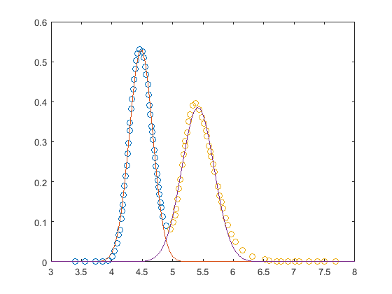

# chromatography
A suite of chromatography programms: Breakthrough curve modelling, isotherm determination, parameters fitting...


## Breif description of each function
* `gaussPeakFit` - Fits a gaussian curve to the data provided. Works for any number of peaks.
* `gaussPeakFit_1p` - Same as gaussPeakFit but is a simpler version that only works for one peak.
* `fitModel_isotherm_KLDF` - Fits a chromatographic model to the data provided. Two parameters are fitted: H and KLDF.
* `LDF_pdepe` - Transport-Dispersive Model (TDM) considering mass transfer resistence in the solid to be dominant and using the Linear Driving Force Model (LDF) approach.
* `isotherm` - Library of isotherm function. Required in several programs. 


## Detailed description of each function

### **gaussPeakFit**

gaussPeakFit fits a gaussian curve to the data provided. Works for any number of peaks.

Gaussian function : f(x) = a * exp( -(x-b)^2 / (2*c^2) ) where, 
a is the max height of the peak,
b is the position of the center of the peak (mean), and
c controls the width of the peak (standard deviation)

##### INPUTS:
`xy` : matrix in the [x y] format containing x, y data points

`peakSplit` : vector containing the x points around which the data is separated into ist respective peaks. For 2 peaks, peakSplit must contain 1 element. To fit a single peak peakSplit must be an empty vector.

`a` : vector cointainig the initial estimations for the max height of the peak (a) for each peak.

`b` : vector cointainig the initial estimations for the mean of the peak (b) for each peak.

`c` : vector cointainig the initial estimations for the standard deviation of the peak (c) for each peak.

##### OUTPUTS:
`Exitflag` : optimization status. If exitflag = 1, optimization converged 

Peak height (`a`),  Peak mean (`b`), and Peak width (`c`) : optimizaed parameters

`R` : correlation coefficient calculated using Matlab corrcoef function 

`AARD` : absolute average relative deviation

`A` : Area under peak calculated using Matlab trapz function

Figure containing the original and fited data

##### Example:
```matlab
Optimized parameters for peak 1: 
Exitflag = 1 
Peak height (a) = 0.5317 
Peak mean (b) = 4.4812 
Peak width (c) = 0.1914 

Fit quality for peak 1: 
Correlation coefficient (R) = 0.9974 , for a p-value of 0.0000 
AARD = 0.2760 

Area under peak 1 (A) = 12.9850 

----- 

Optimized parameters for peak 2: 
Exitflag = 1 
Peak height (a) = 0.3864 
Peak mean (b) = 5.4173 
Peak width (c) = 0.2660 

Fit quality for peak 2: 
Correlation coefficient (R) = 0.9946 , for a p-value of 0.0000 
AARD = 0.3364 

Area under peak 2 (A) = 7.8238
```


